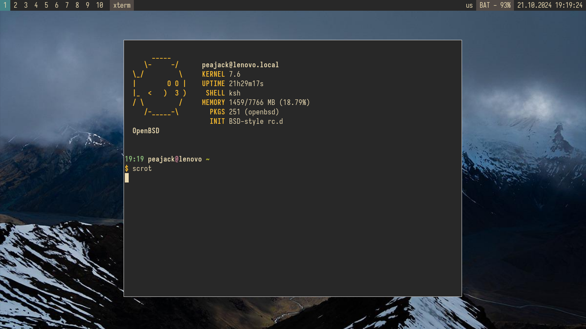
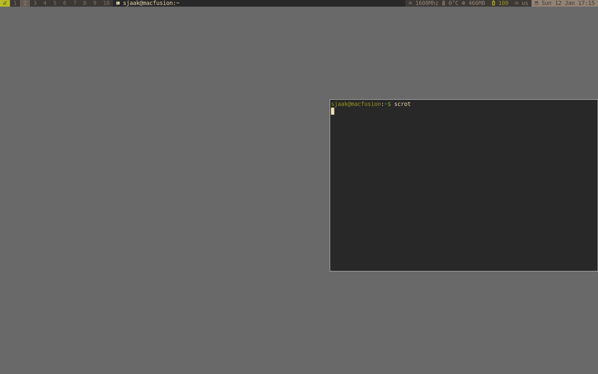

# lemonstatus

generate status for lemonbar. use it with openbsd (kqueue rules!) and cwm.

# build

you need scdoc(1) for manpage

edit config.mk for your needs

```
make install
```

# usage

```sh
lemonstatus | lemonbar -pd -B '#282828' -F '#ebdbb2' 
```

# Nerdfont


To display the glyphs from nerdfont properly use a xft patched lemonbar, for example 
[https://github.com/freundTech/bar](https://github.com/freundTech/bar).

see lemonstatus(1)
